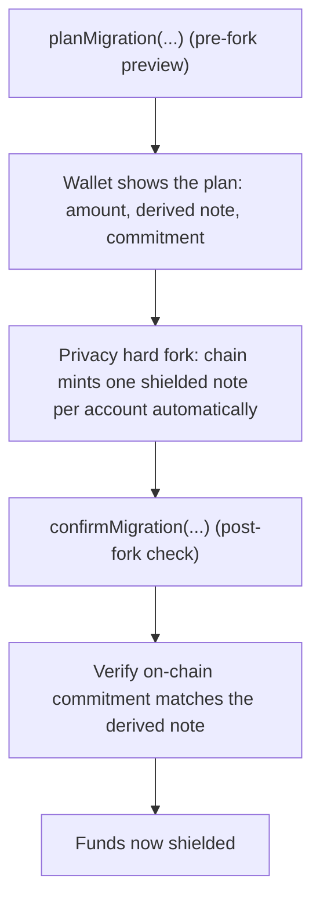

:::note[Activation]
Migration happens at the privacy hard fork, which has not yet activated on the public testnet. The SDK helpers below let wallets prepare for it today; shielded mutation methods currently return error `-32605`.
:::

At the privacy hard fork, the chain **automatically** snapshots every transparent EOA balance at the activation height and mints one shielded note per account for its owner. You do not submit a transaction to migrate — the migration is engine-driven and deterministic. The SDK migration helpers exist so wallets can *preview* the note the fork will mint (`planMigration`) and *confirm* afterwards that the minted note landed on chain (`confirmMigration`).

Voluntary shielding of *new* funds after the fork is a separate operation, done with `mersennet_submitShield`.

## The migration flow



1. **Plan (pre-fork)**: `planMigration` computes the migration note the fork will mint for each account, including its derived randomness and the expected note commitment, so the UI can show the user exactly what they will receive.
2. **Fork**: at the activation height the chain snapshots transparent balances and mints the planned notes automatically. No user transaction is required.
3. **Confirm (post-fork)**: `confirmMigration` checks that the on-chain commitments match the planned notes, giving the wallet a deterministic success/failure signal.

## SDK helpers

The TypeScript SDK exposes the migration surface as typed functions:

| Helper | Purpose |
|---|---|
| `planMigration` | Produce a `MigrationPlan` (amount, derived note, expected commitment) previewing the notes the fork will mint. |
| `confirmMigration` | Verify the post-fork on-chain result against the plan, returning a `MigrationConfirmation`. |
| `deriveMigrationNote` | Deterministically derive the migration note from its parameters. |
| `matchesMigrationNote` | Check whether an on-chain commitment corresponds to a derived migration note. |
| `defaultNoteCommitment` | Deterministic placeholder hasher for tests. Production wallets must inject the chain's Poseidon note-commitment hasher. |

:::caution[Derivation is still a placeholder]
The SDK's `planMigration` / `confirmMigration` derive the note randomness with a `sha256` placeholder; the chain's migration tool derives it as `keccak256("MersennetChain-MigrationRho" ‖ EOA ‖ height)` reduced into the field, with a Poseidon commitment. Until the SDK mirrors that (it will before the fork), the planned note cannot predict or confirm the chain-minted one — treat these helpers as the API shape, not the final math.
:::

```ts
import { planMigration, confirmMigration } from '@mersennet/sdk';

// 1. Pre-fork: plan and show the user what the fork will mint
const plan = planMigration(accounts); // accounts: MigrationNoteParams[]
// plan.notes → derived notes + expected commitments
// plan.totalsByAsset → per-asset totals for user review

// 2. The hard fork mints the notes automatically at the activation height.

// 3. Post-fork: confirm the result deterministically against the scanned notes
const result = confirmMigration(accounts, scannedNotes);
if (!result.complete) {
  // surface a clear error; do not assume success
}
```

The randomness labels (`MIGRATION_RHO_LABEL`, `MIGRATION_PSI_LABEL`) are exported so wallets and tests derive identical notes.

## UX recommendations

- **Plan ahead of the fork.** Show the amount and the derived commitment so the user knows exactly what note they will receive.
- **Confirm deterministically.** Treat a failed `confirmMigration` as a hard error, not a warning.
- **Shielding new funds later** uses `mersennet_submitShield`; large balances may be split into multiple notes for better privacy and future spend flexibility.

After the fork, the wallet reconstructs the new shielded balance via [note scanning](/privacy/note-scanning/). To later reveal a balance to a third party, use [selective disclosure](/privacy/selective-disclosure/).
