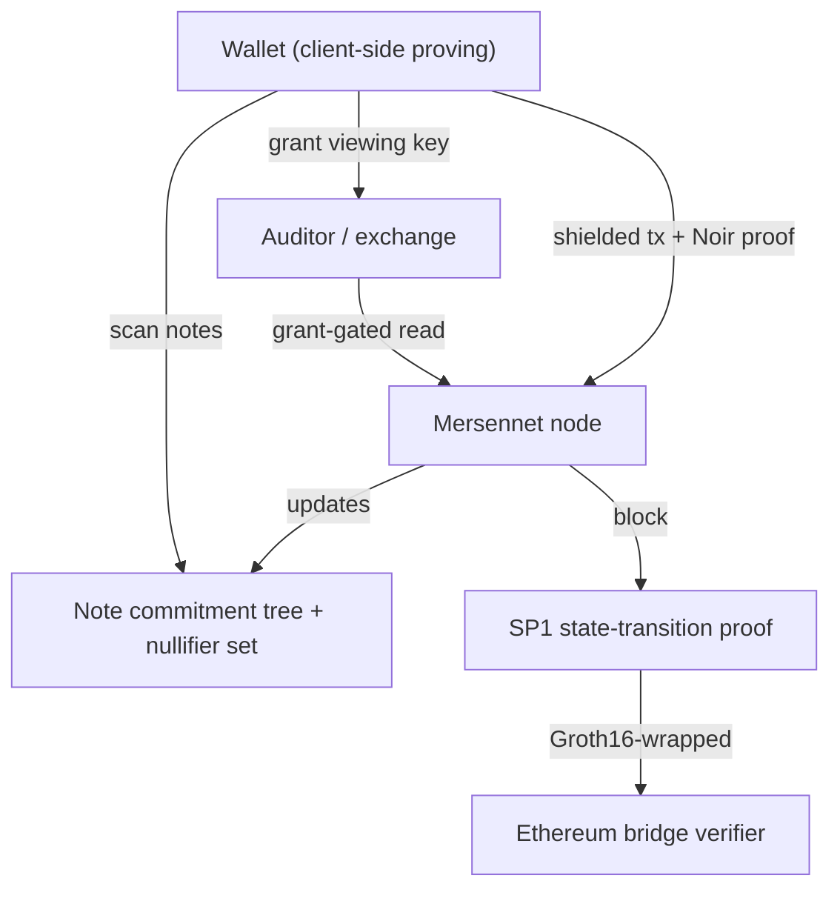

Mersennet is a zero-knowledge Layer 1 where **privacy and verifiability are the defaults**. Instead of bolting a mixer onto a transparent chain, Mersennet provides *account-level* privacy across both the EVM and the native central limit order book (CLOB), Aztec-style, while keeping the chain publicly verifiable through succinct proofs.

## What "account-level privacy" means

On a transparent chain, anyone can read your balances, positions, and order flow from the public state. On Mersennet, that information lives in **shielded accounts**: balances, transfers, positions, and orders are represented as encrypted *notes* committed to an on-chain Merkle tree. The network can verify that every state transition is valid without learning *who* owns what.

| Surface | Transparent chain | Mersennet shielded |
|---|---|---|
| Balances | Public per address | Encrypted notes, owner-only |
| Transfers | Sender, recipient, amount public | Nullifier in / commitment out, amounts hidden |
| Leverage positions | Public, openly liquidatable | Private, solvency proven in ZK |
| Order flow | Public mempool + book | Threshold-encrypted intents |

## The four pillars

- **[Shielded accounts](/privacy/shielded-accounts/)**: balances, transfers, positions, and order flow are concealed using notes, commitments, and nullifiers.
- **[Risk checks in zero knowledge](/privacy/zk-risk-checks/)**: leverage without open liquidations, where solvency and margin are proven with ZK proofs instead of public liquidation auctions.
- **[Selective disclosure](/privacy/selective-disclosure/)**: grant a scoped viewing key to an auditor, exchange, or counterparty and reveal exactly what you choose.
- **[Verifiable state](/privacy/state-proofs/)**: every block's state transition runs through the SP1 proof pipeline. The testnet currently emits **development proofs** (deterministic hash commitments over the block program's outputs — not yet zero-knowledge proofs); real SP1 zkVM proving is enabled by the `sp1` build feature. A Groth16 bridge is designed to verify Mersennet state on Ethereum for trustless light clients.

## How it fits together

## Where to go next

- Building a wallet or app? Start with the **[Shielded SDK](/developers/privacy/shielded-sdk/)** and the **[Shielded JSON-RPC reference](/developers/privacy/shielded-rpc/)**.
- Want the formal protocol? See the **[Whitepaper](/whitepaper/)**.
- Moving funds from transparent to shielded? See **[Migrating to shielded accounts](/privacy/migration/)**.

:::note[Activation]
Shielded features are gated by the privacy hard fork. Before activation, mutation methods **and all viewing-grant methods** return error `-32605` ("shielded methods are disabled until the privacy hard fork activates"). The ungated read methods (`mersennet_getShieldedRoot`, `mersennet_getShieldedBalance`, `mersennet_getShieldedNotes`, and the state-proof methods) return structured responses describing the initial empty state. See [Verifiable state](/privacy/state-proofs/) for details.
:::
