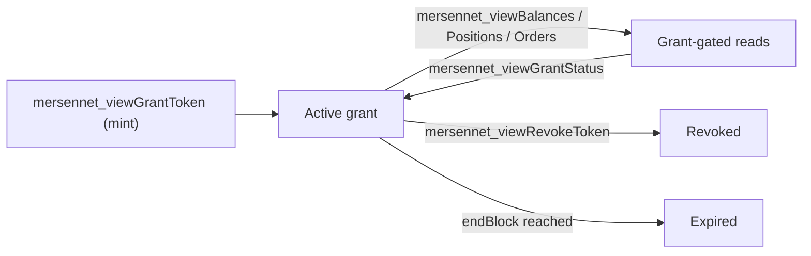

:::note[Activation]
Viewing-grant methods are gated by the privacy hard fork and currently return error `-32605` on the public testnet.
:::

Privacy by default does not mean opacity. Mersennet lets an account holder **grant a scoped viewing key** to an auditor, exchange, or counterparty that reveals exactly the data they need, and nothing else. The rest of the account stays shielded.

## Viewing grants

A viewing grant is a capability you mint and hand to a grantee. It is **scoped**, **time-bounded**, and **revocable**.

- **Scoped**: each grant authorizes one or more read scopes: `notes:read`, `balances:read`, `positions:read`, `orders:read`, `liquidations:read`, `exports:portfolio_digest`.
- **Time-bounded**: grants are valid for a **block-height window** (`startBlock` to `endBlock`); reads fail outside it.
- **Revocable**: the grantor can revoke at any time, immediately invalidating future reads.

```ts
// Pseudo-code over mersennet_viewGrantToken — the real call takes one object with
// grantorCommitmentHex, grantorSigPubkeyHex, granteePubkeyHex, scopes[], startBlock?,
// endBlock and the grantor's signatureHex (see the Shielded JSON-RPC reference).
const { grantToken } = await rpc.viewGrantToken({
  scopes: ['balances:read', 'positions:read'],
  granteePubkeyHex: auditorPubKey,
  startBlock: currentBlock,
  endBlock: currentBlock + 1_296_000, // ~30 days at 2 s blocks
  // …grantor commitment, signing key and signature
});

// The grantee reconstructs only what was shared: reads take { grantIdHex, limit?, cursorHex? }
const view = await rpc.viewBalances({ grantIdHex: grantToken.grantId });
```

## Lifecycle



| Step | Method | Purpose |
|---|---|---|
| Mint | `mersennet_viewGrantToken` | Create a scoped, expiring grant for a grantee. |
| Status | `mersennet_viewGrantStatus` | Check whether a grant is active, expired, or revoked. |
| Read balances | `mersennet_viewBalances` | Grant-gated `balances:read` reconstruction read. |
| Read positions | `mersennet_viewPositions` | Grant-gated `positions:read` reconstruction read. |
| Read orders | `mersennet_viewOrders` | Grant-gated `orders:read` open-order reconstruction read. |
| Revoke | `mersennet_viewRevokeToken` | Invalidate the grant immediately. |

## The node never decrypts your data

Grant-gated reads are **authorization gates, not decryption oracles**. For balances, `mersennet_viewBalances` returns the *encrypted* notes the grantee is authorized to see (paginated), and the grantee runs `reconstructPortfolio` client-side; the node never decrypts a balance. Position and order reads return the public per-market clearing context plus the records needed for the grantee to run `reconstructPositions` / `reconstructOpenOrders` locally, authorized by the grant.

This keeps the trust model honest: a viewing grant lets a specific party recompute a specific view, without ever placing your plaintext on the server.

## Build it

See [Note scanning & wallet reconstruction](/privacy/note-scanning/) for the client-side reconstruction primitives, the [Shielded SDK](/developers/privacy/shielded-sdk/) for typed helpers (`scanGrantedNotes`, `reconstructPortfolio`, `reconstructPositions`, `reconstructOpenOrders`), and the [Shielded JSON-RPC reference](/developers/privacy/shielded-rpc/) for the full method signatures.
