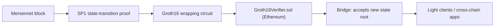

Privacy is only half of the design. The other half is **verifiability**: anyone should be able to confirm that Mersennet's state evolved correctly, from a succinct proof, without trusting a full node. Every block's state transition runs through the **SP1** proof pipeline. The testnet currently emits **development proofs** — deterministic hash commitments over the block program's outputs, not yet zero-knowledge proofs — while real SP1 zkVM proving is enabled by the `sp1` build feature. In the production design, proofs are verified on Ethereum through a **Groth16** bridge (the Ethereum verifier contract is not yet deployed).

## State transition proofs (SP1)

For each block, a prover runs the Mersennet state-transition program inside [SP1](https://docs.succinct.xyz) (a RISC-V zkVM) and produces a proof that:

- The previous state root transitions to the new state root under the block's transactions.
- The previous nullifier root transitions to the new nullifier root (no double-spends).
- The market state hash and block hash are consistent.

The proof and its public outputs are retrievable over JSON-RPC:

```bash
# Fetch the latest state-transition proof
curl -s https://rpc.mersennet.com \
  -H 'content-type: application/json' \
  -d '{"jsonrpc":"2.0","id":1,"method":"mersennet_getLatestStateProof","params":[]}'
```

```json
{
  "blockHeight": 500,
  "prevStateRoot": "0x…",
  "newStateRoot":  "0x…",
  "prevNullifierRoot": "0x…",
  "newNullifierRoot":  "0x…",
  "blockHash":     "0x…",
  "newMarketStateHash": "0x…",
  "txCount": 12,
  "proofBincodeHex": "0x…",
  "proofType": "SP1",
  "proverMode": "development"
}
```

Note that `proofType` is `"SP1"` in both modes; `proverMode` is the authoritative field distinguishing real SP1 proofs from development ones.

A stateless verifier is available as `mersennet_verifyStateProof`, and `mersennet_getStateProof` fetches the proof for any specific block.

## The Ethereum bridge (Groth16)

To anchor Mersennet on Ethereum, the design **wraps the SP1 proof into a Groth16 proof** and submits it to an on-chain verifier. This lets an Ethereum contract (and therefore any Ethereum-based light client) accept Mersennet state roots as soon as a valid proof is verified. The wrapping circuit and `Groth16Verifier.sol` exist in the contracts repo; **this path is not yet live** — no verifier is deployed on Ethereum today.



The bridge contract consumes the proof together with the block program's public outputs (encoded as field elements) and, on success, records the verified state root. The chain-side path that prepares this calldata and the on-chain verification precompile are part of the protocol's verifiable-state workstream.

## Why this enables light clients

A light client does not need to re-execute Mersennet or trust a specific RPC provider. It only needs to:

1. Obtain the latest state proof (`mersennet_getLatestStateProof`).
2. Verify it (`mersennet_verifyStateProof` today, or via the Ethereum Groth16 verifier once deployed).
3. Trust the resulting state root.

This is the foundation for trustless bridges, cross-chain messaging, and independent verification of the chain's privacy invariants.

Note: trustless verification requires `proverMode: "sp1"`. Development proofs verify pipeline integrity end to end, but anyone can regenerate them from public outputs, so they still require trusting the proving node.

## Current Status on Testnet

The testnet generates, gossips, and verifies a state proof for **every block** — this is live today, ahead of the privacy hard fork. Proof responses include a `proverMode` field:

- `development` — the proof pipeline runs end-to-end with a fast development prover (what the testnet currently uses; the [explorer](https://explorer.mersennet.com/verify) labels these "Development proof")
- `sp1` — real SP1 zkVM proving on dedicated prover hardware

The proof format, roots, and verification flow are identical in both modes, so integrations built against development proofs carry over unchanged. See the [Shielded JSON-RPC reference](/developers/privacy/shielded-rpc/) for exact response shapes.
